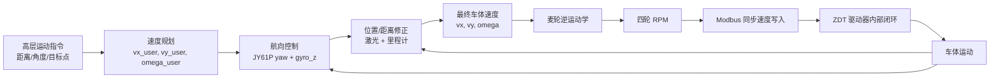
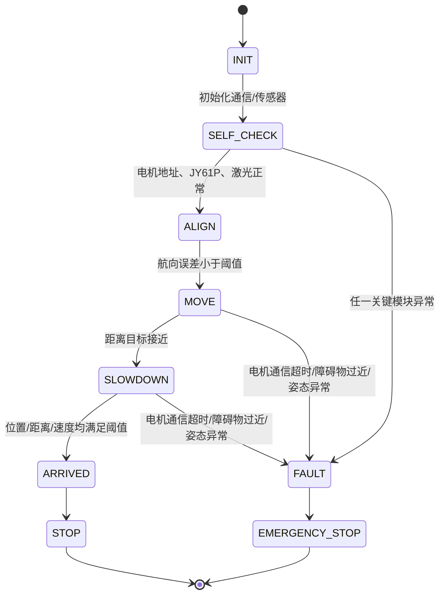
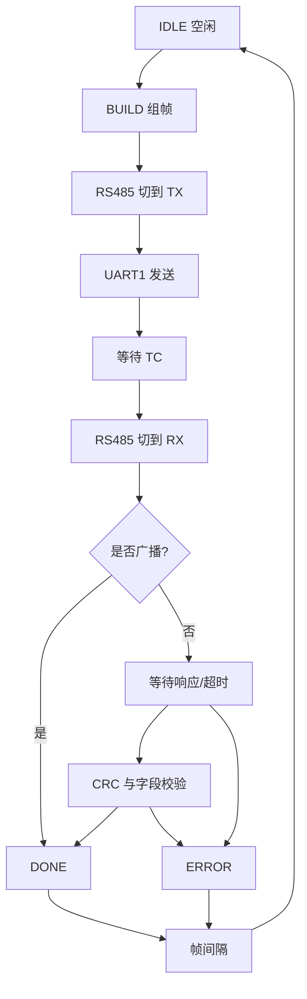
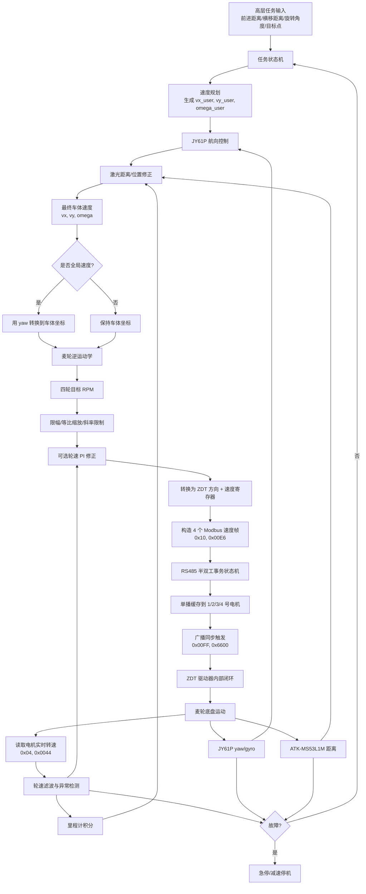

# 麦轮运动控制系统技术设计文档

项目：智能物流搬运小车移动系统  
平台：STM32C8T6，STM32CubeIDE，HAL 库  
执行器：4 × ZDT-X42-V2 闭环步进电机，RS485 总线，Modbus-RTU 速度控制  
传感器：JY61P 陀螺仪，ATK-MS53L1M 激光测距传感器  
版本：V1.0

---

## 0. 文档目标与设计边界

本文档回答移动系统开发中最关键的工程问题：

1. **4 个电机共用一条 RS485 总线时如何区分和同步控制？**
2. **不使用 PWM、只用 Modbus 速度寄存器时，主控侧闭环应如何设计？**
3. **X 形麦克纳姆轮如何从小车期望速度分解到 4 个电机 RPM？**
4. **如何利用 JY61P 和 ATK-MS53L1M 提升直线、转向和到达目标的稳定性？**
5. **STM32 HAL 工程如何划分外设、任务周期、通信优先级和安全停机逻辑？**

本文档不输出完整可编译 C 源码，但给出后续实现需要的寄存器、帧结构、函数原型、伪代码、状态机和关键参数。

### 0.1 资料依据与一致性说明

压缩包中电机资料包括：

- `电机相关资料/说明书/ZDT_X57_V2 Modbus-RTU指令说明.pdf`
- `电机相关资料/说明书/ZDT_X57_V2步进闭环驱动说明书Rev1.0.pdf`
- `电机相关资料/STM32F1例程/串口_RS232_RS485通讯控制`

虽然 PDF 文件名为 `ZDT_X57_V2`，说明书封面明确标注 **X28 / X35 / X42 / X57 通用**，因此可作为 ZDT-X42-V2 通信与控制设计依据。

资料中与本项目直接相关的配置点：

| 项目 | 结论 |
|---|---|
| 通信方式 | RS485，总线式半双工 |
| 协议 | Modbus-RTU，需在驱动器 `Checksum` 菜单选择 `Modbus` |
| 波特率 | 默认 115200，8N1；可在 `UartBaud` 菜单修改 |
| 通信端口复用 | `P_Serial` 菜单需设为 `UART_FUN` |
| 地址 | 默认地址 1，可设 1-255，0 为广播地址 |
| 接线 | PA9(TX)、PA10(RX) 通过 RS485 模块连接；驱动器端 `R/A/H` 接 RS485 A，`T/B/L` 接 RS485 B；按驱动器实物丝印/手册最终核对 |
| 控制方式 | 不使用 PWM；速度、使能、停止、同步触发均通过 Modbus 寄存器完成 |

> 注意：官方例程中有提醒“两条命令之间发送需要延迟 1-10 ms”。对 Modbus-RTU 来说标准帧间隔只要求大于 3.5 个字符时间，但工程实现建议保守加入 1-2 ms 总线保护间隔，调试稳定后再缩短。

### 0.2 机械参数

| 参数 | 符号 | 数值 |
|---|---:|---:|
| 麦克纳姆轮直径 | `D` | 75 mm = 0.075 m |
| 麦克纳姆轮半径 | `r = D / 2` | 37.5 mm = 0.0375 m |
| 单轮厚度 | - | 33 mm |
| 左右轮中心间距 / 轮距 | `W` | 320 mm = 0.320 m |
| 前后轮中心间距 / 轴距 | `L` | 220 mm = 0.220 m |
| 麦轮旋转耦合臂长 | `K = (L + W) / 2` | 0.270 m |
| 轮周长 | `C = πD` | 0.23562 m |

这里将用户给出的轮距、轴距视为左右轮接触中心、前后轮接触中心之间的距离。若后续机械测量发现轮距定义不是轮接触中心距，应重新修正 `W`，否则旋转角速度分解会有比例误差。

---

## 1. 问题一：4 个电机共用一条 RS485 总线，如何寻址和同步？

### 1.1 总线上的 4 个电机如何区分？

RS485 只是物理层，不能自动区分设备。4 个电机在同一条 RS485 总线上共存时，必须依靠 **Modbus-RTU 从机地址**区分目标电机。该机制与 I²C 设备地址类似：主控发送的每一帧都带有 `Slave Address`，只有地址匹配的驱动器响应和执行。

驱动器地址规则：

- 默认地址：`1`
- 可设置范围：`1-255`
- `0`：广播地址，不可设置为电机自身地址
- 广播地址用于让所有驱动器同时接收命令；Modbus 广播不应等待从机回复

建议本项目地址分配如下：

| 轮号 | 位置 | 建议从机地址 | 变量名 |
|---:|---|---:|---|
| 1 | 前左轮 FL | `0x01` | `MOTOR_ADDR_FL` |
| 2 | 前右轮 FR | `0x02` | `MOTOR_ADDR_FR` |
| 3 | 后左轮 RL | `0x03` | `MOTOR_ADDR_RL` |
| 4 | 后右轮 RR | `0x04` | `MOTOR_ADDR_RR` |

#### 地址设置方法

优先使用驱动器 OLED 菜单逐台设置：

1. 只给第 1 个电机上电，进入 `ID_Addr`，设为 `1`。
2. 只给第 2 个电机上电，设为 `2`。
3. 只给第 3 个电机上电，设为 `3`。
4. 只给第 4 个电机上电，设为 `4`。
5. 全部接入总线后，主控分别读取 1-4 地址验证通信。

如果使用 Modbus 修改地址，必须保证总线上同一时刻只有一个默认地址相同的电机在线，否则多个默认地址 `1` 的电机会同时响应，导致总线冲突。修改地址寄存器如下：

| 功能 | 功能码 | 起始寄存器 | 寄存器数量 | 数据格式 |
|---|---:|---:|---:|---|
| 修改 ID 地址 | `0x10` | `0x00A2` | `0x0002` | Reg1=`0x4B + 是否存储`，Reg2=`地址 + 0x00` |

示例：将地址 `1` 修改为 `2` 并存储，帧体为：

```text
01 10 00 A2 00 02 04 4B 01 02 00 CRC_L CRC_H
```

其中 `01` 为“是否存储”。CRC 不建议手工硬编码，应由统一的 Modbus CRC16 函数计算。

---

### 1.2 Modbus-RTU 帧基本结构是什么？

所有 Modbus-RTU 帧采用以下结构：

```text
+-------------+---------------+-------------------+--------------+
| 从机地址     | 功能码          | 数据区              | CRC16        |
| 1 byte      | 1 byte        | N bytes           | CRC_L CRC_H  |
+-------------+---------------+-------------------+--------------+
```

关键规则：

1. CRC 为 Modbus CRC16，多项式 `0xA001`，初值 `0xFFFF`。
2. 帧尾发送顺序是 `CRC_L` 再 `CRC_H`。例如读取 1 号电机实时转速：

```text
01 04 00 44 00 02 31 DE
```

上述帧的 CRC 数值为 `0xDE31`，发送顺序为 `31 DE`。

3. 16 bit 寄存器内部按 Modbus 常规高字节在前，即 `Hi` 后 `Lo`。
4. 资料说明所有 32 bit 数据先传低字、再传高字，主要影响位置角度等 32 bit 字段；速度模式本身只使用 16 bit 速度字段。
5. 本项目主要用到的功能码：

| 功能码 | 含义 | 用途 |
|---:|---|---|
| `0x04` | 读输入寄存器 | 读取实时转速、实时位置、系统状态 |
| `0x06` | 写单个寄存器 | 清零、校准等简单命令，可选 |
| `0x10` | 写多个寄存器 | 速度模式、使能、同步触发、修改参数 |

---

### 1.3 单个电机速度指令如何组织？

速度模式控制使用 `0x10` 写多个寄存器：

| 字段 | 值 |
|---|---:|
| 功能码 | `0x10` |
| 起始寄存器 | `0x00E6` |
| 寄存器数量 | `0x0004` |
| 字节数 | `0x08` |

4 个寄存器含义如下：

| 寄存器 | 含义 | 数据建议 |
|---|---|---|
| Reg1 | 方向 | `0x0000` = CW，`0x0001` = CCW |
| Reg2 | 加速度 | 单位 `RPM/s`，`uint16_t` |
| Reg3 | 速度 | 单位按 Modbus 速度模式表为 `RPM`，`uint16_t` |
| Reg4 | 多机同步标志 + 保留字节 | `0x0000` = 立即执行；`0x0100` = 缓存等待同步触发 |

> 实施校验点：同一份 Modbus 文档在位置模式中明确写明“速度和位置角度要放大 10 倍输入”，而速度模式表只标注 `速度(RPM)`，没有写放大 10 倍。因此本设计对 `0x00E6` 速度模式先按整数 RPM 实现。驱动联调时应做 60 RPM、120 RPM、300 RPM 三点实测；若发现该驱动固件在速度模式也按 0.1 RPM 解析，只需将 `ZDT_SPEED_MODE_SCALE` 从 `1` 改为 `10`，通信与控制架构不变。

单电机速度帧模板：

```text
[Addr] 10 00 E6 00 04 08 [Dir_H] [Dir_L] [Acc_H] [Acc_L] [Spd_H] [Spd_L] [Sync_H] 00 [CRC_L] [CRC_H]
```

示例：1 号电机，CW，目标 `150 RPM`，加速度 `1000 RPM/s`，设置同步缓存标志：

```text
01 10 00 E6 00 04 08 00 00 03 E8 00 96 01 00 BD 14
```

如果不使用同步缓存，最后一个寄存器改为 `00 00`，即收到后立即执行。

---

### 1.4 如何实现四电机同步速度更新？

有两种策略。

#### 策略 A：连续单播，立即生效

主控依次向 1、2、3、4 号电机发送速度命令，Reg4=`0x0000`。每个电机收到后立即更新速度。

优点：实现简单；不需要额外同步触发帧。  
缺点：4 个电机更新存在数毫秒级时间差；在低速直线行驶时通常可接受，在起步、急停、旋转切换时可能造成姿态抖动。

适用场景：

- 低速巡航
- 对严格同步要求不高的速度微调
- 总线负载较高、周期较紧时

#### 策略 B：单播缓存 + 广播同步触发

主控先分别向 1、2、3、4 号电机发送速度命令，Reg4=`0x0100`，让驱动器缓存命令但暂不动作；随后使用广播地址 `0x00` 发送“触发多机同步运动”。

同步触发寄存器：

| 功能 | 功能码 | 起始寄存器 | 数量 | 数据 |
|---|---:|---:|---:|---|
| 触发多机同步运动 | `0x10` | `0x00FF` | `0x0001` | `0x6600` |

广播触发帧：

```text
00 10 00 FF 00 01 02 66 00 94 6F
```

同步控制流程：

```text
1. 写 1 号速度命令，Sync_H = 0x01，等待 1 号响应
2. 写 2 号速度命令，Sync_H = 0x01，等待 2 号响应
3. 写 3 号速度命令，Sync_H = 0x01，等待 3 号响应
4. 写 4 号速度命令，Sync_H = 0x01，等待 4 号响应
5. 用广播地址 0x00 发送 0x00FF 同步触发帧，不等待响应
6. 4 个电机同时执行缓存的速度命令
```

建议：项目默认采用 **策略 B**，在起步、停止、直线-横移-旋转模式切换时保持四轮同步；若实测总线周期不足，再对巡航阶段降级为策略 A。

---

### 1.5 RS485 半双工发送流程如何设计？

RS485 总线半双工意味着同一时刻只能发送或接收。STM32 侧必须用一个 GPIO 控制 RS485 收发器方向，通常为：

- `RS485_DIR = 1`：发送使能，DE=1，/RE=1 或接收关闭
- `RS485_DIR = 0`：接收使能，DE=0，/RE=0

具体电平以实际 RS485 模块为准。文档中不指定该 GPIO 的物理引脚，工程中统一命名为 `RS485_DIR_GPIO`。

发送单帧的软件流程：

```text
Modbus_BuildFrame()
    ↓
等待总线空闲 / 获得 Modbus 总线互斥锁
    ↓
清空 UART1 RX 缓冲区，避免旧数据污染
    ↓
RS485_DIR = TX
    ↓
短延时 t_DE_ON，等待收发器进入发送态
    ↓
HAL_UART_Transmit 或 DMA/IT 发送
    ↓
等待 UART 发送完成，必须等 TC，而不是只等 TXE
    ↓
短延时 1 个字符时间，确保最后一位完全离开总线
    ↓
RS485_DIR = RX
    ↓
若为单播帧：等待响应、校验 CRC、解析返回
若为广播帧：不等待响应
    ↓
帧间保护间隔 t_gap，建议初始 1-2 ms
    ↓
释放总线互斥锁
```

必须避免的错误：

1. **未等待 TC 就切换到接收**：最后 1-2 个字节可能被截断。
2. **发送后仍保持 TX 方向**：从机响应无法进入主控 UART，表现为超时。
3. **多个上层任务同时调用 UART1 发送**：必须通过统一的 Modbus 事务状态机串行化。
4. **广播命令后等待响应**：Modbus 广播没有从机响应，等待会浪费周期甚至误判超时。

---

## 2. 问题二：如何读取电机实时转速，并设计主控侧闭环？

### 2.1 如何读取单个电机实时转速？

读取实时转速使用 `0x04` 功能码：

| 字段 | 值 |
|---|---:|
| 功能码 | `0x04` |
| 起始寄存器 | `0x0044` |
| 寄存器数量 | `0x0002` |
| 返回字节数 | `0x04` |

请求帧模板：

```text
[Addr] 04 00 44 00 02 [CRC_L] [CRC_H]
```

1 号电机示例：

```text
01 04 00 44 00 02 31 DE
```

响应帧结构：

```text
[Addr] 04 04 [Sign_H] [Sign_L] [RPM_H] [RPM_L] [CRC_L] [CRC_H]
```

解析规则：

```text
sign = Reg1        // 0 = 正，1 = 负
rpm_raw = Reg2     // 电机实时转速，单位按资料标注为 RPM
rpm = (sign == 0) ? rpm_raw : -rpm_raw
```

如果联调后确认驱动返回值存在 0.1 RPM 缩放，则统一使用：

```text
rpm = sign * rpm_raw / ZDT_SPEED_FEEDBACK_SCALE
```

其中 `ZDT_SPEED_FEEDBACK_SCALE` 初始为 `1`。

---

### 2.2 如何同时获得 4 个电机当前转速？

单条 RS485 半双工总线上不能真正并行读取 4 个电机；正确方式是 **主控单主机轮询**。只要每次只向一个地址发起读取请求，就不会产生从机响应冲突。

推荐两种读取策略。

#### 策略 A：整组轮询

每个反馈周期按地址 1、2、3、4 依次读取：

```text
ReadSpeed(1) → ReadSpeed(2) → ReadSpeed(3) → ReadSpeed(4)
```

读取完成后得到近似同一时刻的 4 个转速快照。该策略适合启用四轮速度 PI 的场景。

建议周期：

- 四轮速度反馈周期：`40-50 ms`
- 主控制周期：`20 ms`
- 即每 2 个主控制周期完成一次四轮反馈快照

#### 策略 B：分散轮询

每个 `20 ms` 主控制周期只读 1-2 个电机，按轮号循环：

```text
周期 1：读 1、2
周期 2：读 3、4
周期 3：读 1、2
...
```

优点是通信负载更均匀，适合主控侧不强依赖高速轮速 PID、主要依靠驱动器内部闭环和 IMU 航向闭环的场景。

#### 可选：读取系统状态参数

若需要同时获得电压、电流、转速、位置、温度、状态位，可读系统状态参数：

| 功能 | 功能码 | 起始寄存器 | 数量 |
|---|---:|---:|---:|
| 读取系统状态参数 | `0x04` | `0x0078` | `0x0011` |

该帧返回内容更多，适合低频诊断，例如 `5-10 Hz`。控制环中只需要速度时，优先使用 `0x0044`，降低总线占用。

---

### 2.3 主控侧是否需要再做速度 PID？

结论：**默认不做完整的高速电机速度内环 PID；保留低频轮速修正 PI 作为可选功能。**

原因如下：

1. ZDT-X42-V2 是闭环步进驱动器，本身具有电流、速度、位置等闭环能力。主控通过 Modbus 给的是速度目标，不是 PWM 占空比。
2. 如果主控再以很高频率对电机 RPM 做 PID，本质是“外部速度环套内部速度环”，周期又受 RS485 总线限制，容易产生滞后、积分饱和和振荡。
3. 仅使用电机编码器速度反馈，并不能直接检测轮地打滑。车轮打滑时，电机 RPM 可能完全正常，但车体实际位移不正确。打滑更应该由 IMU 航向、激光距离、里程计残差来修正。
4. 主控侧可以做 **低频监督型 PI**：用于校正四轮跟随误差、负载差异、方向标定误差、小幅补偿驱动器响应差异，而不是替代驱动器内部速度环。

推荐闭环层级：

```text
高层任务：前进距离 / 横移距离 / 旋转角度 / 到目标点
        ↓
路径与速度规划：vx_ref, vy_ref, omega_ref
        ↓
航向/位置外环：JY61P + 激光 + 里程计修正 vx, vy, omega
        ↓
麦轮逆运动学：计算四轮 rpm_ref
        ↓
可选低频轮速 PI：rpm_cmd = rpm_ref + delta_rpm
        ↓
Modbus 速度命令写入 ZDT 驱动器
        ↓
驱动器内部闭环：电流/速度/位置控制
        ↓
读取电机 rpm_fb，供监督 PI、里程计和故障诊断使用
```

### 2.4 可选轮速 PI 控制框图


可选 PI 公式：

```text
e_i(k) = rpm_ref_i(k) - rpm_fb_i(k)
I_i(k) = clamp(I_i(k-1) + e_i(k) * T_pid, I_min, I_max)
delta_i = Kp * e_i(k) + Ki * I_i(k)
rpm_cmd_i = clamp(rpm_ref_i + delta_i, -RPM_LIMIT, RPM_LIMIT)
```

工程建议：

- 初期只使用 `Kp`，`Ki = 0`。
- `delta_i` 限制在 `±10%` 到 `±20%` 的 `rpm_ref_i` 范围内，避免主控 PI 与驱动器内部速度环对抗。
- 当 `|rpm_ref_i|` 很小，例如接近 0 时，禁用积分，直接下发 0 RPM，避免低速抖动。
- 若通信周期大于 50 ms，不建议使用激进 PI 参数。

### 2.5 PID 控制周期如何选择？

推荐初始周期如下：

| 控制/采样项 | 建议周期 | 说明 |
|---|---:|---|
| 主运动控制周期 | `20 ms` | 50 Hz；计算速度规划、航向修正、麦轮分解 |
| 四轮速度反馈快照 | `40-50 ms` | 每 2 个主周期读完 4 个电机；用于监督 PI 和里程计 |
| 轮速 PI 周期 | `40-50 ms` | 与四轮反馈快照对齐 |
| JY61P 航向控制 | `10-20 ms` | 优先使用最新 yaw / gyro_z |
| 激光距离修正 | `50-100 ms` | 取决于传感器更新率和安装方式 |
| 电机状态诊断 | `100-200 ms` | 电流、电压、温度、状态位低频读取 |

如果后续总线优化到 DMA + 中断 + 较短帧间隔，并且实测电机响应稳定，可将四轮速度反馈周期缩短到 20-30 ms；否则不建议为了轮速 PID 占满总线。

### 2.6 转速反馈滤波与异常值处理

实时转速反馈进入控制或里程计前必须做校验和滤波。

#### 数据有效性检查

单个电机反馈满足以下条件才更新：

1. 地址匹配。
2. 功能码匹配；若收到 `function | 0x80`，按 Modbus 异常处理。
3. 字节数正确。
4. CRC 正确。
5. 符号寄存器只允许 `0` 或 `1`。
6. 转速未超过配置的 `RPM_LIMIT` 或驱动器最大速度限制。
7. 与上一有效值的差值不超过物理加速度约束：

```text
abs(rpm_now - rpm_last) <= ACC_LIMIT_RPM_S * dt * margin
```

其中 `margin` 可取 `1.5-2.0`，用于容忍瞬时响应。

#### 滤波策略

建议使用一阶 IIR 低通：

```text
rpm_filt(k) = alpha * rpm_raw(k) + (1 - alpha) * rpm_filt(k-1)
```

`alpha` 初始取 `0.3-0.5`。如果反馈抖动较大，可加入 3 点中值滤波，但不要引入过大延迟。

#### 超时处理

| 情况 | 处理 |
|---|---|
| 单次读取超时 | 保持上一有效值，不立即停机 |
| 连续 3 次超时 | 标记该电机通信故障，整车进入减速停机 |
| CRC 错误频繁 | 降低总线频率、增大帧间隔、检查 A/B 接线和终端匹配 |
| 地址冲突 | 多个驱动器可能默认地址相同，必须逐台隔离重新设置地址 |

---

## 3. 问题三：X 形麦克纳姆轮如何进行速度分解？

### 3.1 坐标系、轮序号与正方向定义

本文采用车体坐标系：

- `+x`：车体前方
- `+y`：车体左方
- `+z`：竖直向上
- `+ω`：绕 `+z` 逆时针旋转，即从上往下看逆时针

轮序号：

```text
             +x 前方

        1:FL          2:FR
        前左          前右

              车体中心 O ---- +y 左方

        3:RL          4:RR
        后左          后右
```

麦克纳姆轮采用 X 形布局。本文定义 **正轮速** 为“该轮单独正转时，其对车体的贡献方向与整车前进方向一致”。由于电机实际安装方向、减速结构、接线方向可能不同，最终下发到驱动器的 CW/CCW 必须通过每轮方向系数标定：

```text
motor_dir_sign[i] = +1 或 -1
```

调试时逐个给每个电机低速正转，观察车轮切向是否符合本文正轮速定义；不符合则反转该轮的软件方向系数，而不要修改运动学公式。

### 3.2 逆运动学方程

设小车中心期望速度为：

```text
v_x      车体坐标系前向速度，m/s
v_y      车体坐标系左向速度，m/s
omega    车体绕 z 轴角速度，rad/s
```

定义：

```text
K = (L + W) / 2
```

四个轮子的目标线速度为：

```text
v_1 = v_x - v_y - K * omega      // 前左 FL
v_2 = v_x + v_y + K * omega      // 前右 FR
v_3 = v_x + v_y - K * omega      // 后左 RL
v_4 = v_x - v_y + K * omega      // 后右 RR
```

矩阵形式：

```text
[ v_1 ]   [ 1  -1  -K ] [ v_x   ]
[ v_2 ] = [ 1   1   K ] [ v_y   ]
[ v_3 ]   [ 1   1  -K ] [ omega ]
[ v_4 ]   [ 1  -1   K ]
```

将轮线速度转换为电机目标转速：

```text
rpm_i = v_i / (π * D) * 60
```

其中 `D = 0.075 m`。

### 3.3 正运动学与里程计

读取到四轮实际 RPM 后，先转换为轮线速度：

```text
v_i = rpm_i * (π * D) / 60
```

在同一套符号定义下，车体速度可估计为：

```text
v_x_est   = ( v_1 + v_2 + v_3 + v_4 ) / 4
v_y_est   = (-v_1 + v_2 + v_3 - v_4 ) / 4
omega_est = (-v_1 + v_2 - v_3 + v_4 ) / (4 * K)
```

里程计积分时，建议使用 JY61P 的航向角替代纯轮速积分出来的 `theta`，因为麦轮横移和打滑会让轮速里程计的航向误差积累很快。

全局坐标积分：

```text
v_x_global = cos(theta) * v_x_est - sin(theta) * v_y_est
v_y_global = sin(theta) * v_x_est + cos(theta) * v_y_est

x = x + v_x_global * dt
y = y + v_y_global * dt
theta = yaw_from_JY61P
```

### 3.4 从全局速度到车体速度

如果上层规划器输出的是全局坐标速度 `(v_x_g, v_y_g)`，需要用当前航向 `theta` 转换到车体坐标系：

```text
v_x_b =  cos(theta) * v_x_g + sin(theta) * v_y_g
v_y_b = -sin(theta) * v_x_g + cos(theta) * v_y_g
omega_b = omega_g
```

然后将 `(v_x_b, v_y_b, omega_b)` 送入逆运动学。

### 3.5 函数原型设计

建议使用如下抽象，后续可直接落到 C 文件中：

```c
// 伪代码：类型名仅用于说明，不代表最终完整 C 实现

typedef struct {
    float vx;       // m/s，若 field_oriented=true 表示全局 x 速度，否则表示车体 x 速度
    float vy;       // m/s
    float omega;    // rad/s
} ChassisVel_t;

typedef struct {
    float wheel_rpm[4];     // FL, FR, RL, RR，带符号
} WheelRpm_t;

void Mecanum_InverseKinematics(
    const ChassisVel_t *cmd,
    float yaw_rad,
    bool field_oriented,
    float rpm_limit,
    WheelRpm_t *out
);
```

### 3.6 逆运动学伪代码

```c
function Mecanum_InverseKinematics(cmd, yaw_rad, field_oriented, rpm_limit):
    D = 0.075
    L = 0.220
    W = 0.320
    K = (L + W) / 2.0

    if field_oriented:
        vx =  cos(yaw_rad) * cmd.vx + sin(yaw_rad) * cmd.vy
        vy = -sin(yaw_rad) * cmd.vx + cos(yaw_rad) * cmd.vy
    else:
        vx = cmd.vx
        vy = cmd.vy

    omega = cmd.omega

    wheel_v[FL] = vx - vy - K * omega
    wheel_v[FR] = vx + vy + K * omega
    wheel_v[RL] = vx + vy - K * omega
    wheel_v[RR] = vx - vy + K * omega

    for i in 0..3:
        rpm[i] = wheel_v[i] / (PI * D) * 60.0

    // 等比缩放，保持运动方向不变
    max_abs = max(abs(rpm[0]), abs(rpm[1]), abs(rpm[2]), abs(rpm[3]))
    if max_abs > rpm_limit:
        scale = rpm_limit / max_abs
        for i in 0..3:
            rpm[i] = rpm[i] * scale

    return rpm
```

### 3.7 轮速到 Modbus 方向与速度值的转换

逆运动学输出的 `rpm[i]` 是“车辆运动学正方向”的有符号值，而 ZDT 驱动器速度模式需要：

- 方向：CW 或 CCW
- 速度：非负数 RPM

转换伪代码：

```c
function ConvertRpmToZdtCommand(i, rpm_signed):
    // motor_dir_sign[i] 通过实车标定得到，+1 表示运动学正方向对应 CW
    rpm_motor = rpm_signed * motor_dir_sign[i]

    if rpm_motor >= 0:
        dir = CW
    else:
        dir = CCW

    speed_abs = abs(rpm_motor)
    speed_reg = round(speed_abs * ZDT_SPEED_MODE_SCALE)
    speed_reg = clamp(speed_reg, 0, 0xFFFF)

    return dir, speed_reg
```

### 3.8 典型运动的符号检查

| 期望动作 | 轮速关系 |
|---|---|
| 前进 `v_x > 0` | 四轮同号同速 |
| 左移 `v_y > 0` | FL、RR 为负；FR、RL 为正 |
| 原地逆时针旋转 `omega > 0` | FL、RL 为负；FR、RR 为正 |
| 右前斜向 | 由前进与右移叠加得到，部分轮速可能接近 0 |

调车时若某个动作方向相反，优先检查：

1. `motor_dir_sign[i]` 是否标定正确。
2. 轮号 FL/FR/RL/RR 是否与地址 1/2/3/4 对应。
3. 麦轮是否实际为 X 形而不是 O 形安装。
4. RS485 指令中的 CW/CCW 是否与驱动器菜单 `Dir` 设置有关。

---

## 4. 问题四：如何用 JY61P 与激光测距实现稳健移动？

### 4.1 JY61P 在控制系统中的角色

JY61P 提供姿态和航向角，是麦轮小车稳定控制中最重要的反馈量。麦轮底盘容易受轮径差、地面摩擦差、负载偏心和横移打滑影响；仅靠四轮速度积分，航向误差会快速累积。

JY61P 应用于三类控制：

1. **直线行驶保持航向**：前进或横移时锁定初始航向，自动修正偏航。
2. **旋转到指定角度**：角度闭环输出 `omega_ref`。
3. **全局速度转换**：将全局坐标速度转换为车体坐标速度，实现 field-oriented 控制。

### 4.2 航向角闭环控制

在执行“前进指定距离”“横移指定距离”“沿墙走”等任务时，进入运动状态时记录：

```text
theta_ref = yaw_current
```

每个控制周期计算角度误差：

```text
e_theta = wrap_to_pi(theta_ref - yaw_current)
```

航向修正角速度：

```text
omega_corr = Kp_yaw * e_theta - Kd_yaw * gyro_z
```

最终角速度命令：

```text
omega_cmd = omega_user + omega_corr
omega_cmd = clamp(omega_cmd, -omega_max, +omega_max)
```

其中：

- `omega_user` 是上层主动要求的旋转速度；直线行驶时通常为 0。
- `gyro_z` 是 JY61P 输出的 z 轴角速度，作为阻尼项。
- `wrap_to_pi()` 必须处理 `-π` 到 `+π` 的跨越，避免 359° 到 1° 被误判为 358° 误差。

角度闭环伪代码：

```c
function HeadingHold(cmd_vx, cmd_vy, omega_user, yaw, gyro_z):
    e = WrapToPi(theta_ref - yaw)
    omega_corr = Kp_yaw * e - Kd_yaw * gyro_z
    omega = omega_user + omega_corr
    omega = clamp(omega, -OMEGA_LIMIT, OMEGA_LIMIT)
    return ChassisVel(cmd_vx, cmd_vy, omega)
```

### 4.3 转向到指定角度

旋转动作可单独建模为角度位置环：

```text
theta_target = theta_start + delta_theta

e_theta = wrap_to_pi(theta_target - yaw_current)
omega_ref = Kp_turn * e_theta - Kd_turn * gyro_z
```

到达判定：

```text
abs(e_theta) < theta_tol
and abs(gyro_z) < gyro_tol
持续 N 个控制周期
```

到达后发送 4 轮 0 RPM 速度命令，必要时再发送立即停止命令。

### 4.4 级联控制架构



核心思想：

- JY61P 不直接控制电机，而是修正 `omega`。
- 激光不直接控制电机，而是修正 `vx/vy` 或位置估计。
- 麦轮运动学始终是最后一级速度分解模块。

---

### 4.5 ATK-MS53L1M 如何辅助定位和减速？

ATK-MS53L1M 用于距离测量和环境感知。本文不设计完整 SLAM，只设计可实现的距离/位置修正逻辑。

由于传感器具体安装方向未在项目背景中固定，软件中必须配置传感器外参：

```text
laser_mount_x       传感器相对车体中心 x 偏移
laser_mount_y       传感器相对车体中心 y 偏移
laser_mount_yaw     传感器测距方向相对车体 x 轴夹角
```

如果初期只做前向测距，可将 `laser_mount_yaw = 0`；如果做沿墙控制，侧向安装时可设置为 `±90°`。

#### 逻辑 A：到目标距离缩短时减速

适用于“前进到距目标/墙面指定距离”。

```text
d = laser_distance
remain = d - d_stop

if remain <= 0:
    vx_limit = 0
else:
    vx_limit = sqrt(2 * a_brake * remain)

vx_cmd = clamp(vx_cmd, -vx_limit, +vx_limit)
```

这相当于按制动距离限制最大速度，避免快到目标时冲过头。

#### 逻辑 B：沿墙走横向距离闭环

侧向测距时，设期望墙距为 `d_ref`：

```text
e_d = d_ref - d_meas
vy_corr = Kp_wall * e_d - Kd_wall * d_dot
```

将 `vy_corr` 叠加到车体横向速度命令，JY61P 同时保持航向不变。

```text
vx_final = vx_user
vy_final = vy_user + vy_corr
omega_final = omega_user + yaw_correction
```

#### 逻辑 C：利用距离突变作为位置重置线索

在物流场景中，墙面、货架边缘、定位板可能形成明显距离变化。可以用距离残差判断是否遇到已知特征：

```text
r = d_meas - d_expected_from_map

if abs(r) < gate:
    pose = pose + K_laser * r * sensor_axis
else if abs(d_meas - d_last) > jump_threshold:
    mark_feature_event()
else:
    treat_as_outlier()
```

该逻辑不是 SLAM，只是对里程计进行弱修正。`K_laser` 可取 `0.1-0.5`，调试时从小值开始。

### 4.6 里程计、陀螺仪、激光的融合方式

推荐使用轻量级互补融合：

1. 轮速里程计负责估计短时平移量。
2. JY61P yaw 直接作为航向角，替代轮速积分航向。
3. 激光距离在低频下修正某一方向上的位置误差。

伪代码：

```c
function PoseEstimator_Update(dt):
    rpm_fb = Motor_GetFilteredRpm()
    wheel_v = RpmToWheelVelocity(rpm_fb)
    vx_body, vy_body, omega_wheel = Mecanum_ForwardKinematics(wheel_v)

    yaw = JY61P_GetYawRad()

    vx_global = cos(yaw) * vx_body - sin(yaw) * vy_body
    vy_global = sin(yaw) * vx_body + cos(yaw) * vy_body

    pose.x += vx_global * dt
    pose.y += vy_global * dt
    pose.theta = yaw

    if Laser_HasNewValidData():
        residual = Laser_CalcResidual(pose)
        if abs(residual) < LASER_GATE:
            pose = Pose_CorrectAlongLaserAxis(pose, residual)
```

### 4.7 “保持面向目标方向”的状态机

目标需求：小车移动过程中尽量保持朝向目标方向，或保持指定朝向。

状态机如下：



每个状态职责：

| 状态 | 职责 |
|---|---|
| `INIT` | 初始化 UART1、TIM、GPIO、传感器驱动、Modbus 状态机 |
| `SELF_CHECK` | 扫描电机 1-4，读取一次转速/状态，检查 JY61P 和激光数据有效性 |
| `ALIGN` | 根据目标方向或任务方向旋转对准，或记录当前航向为 `theta_ref` |
| `MOVE` | 按目标速度移动，JY61P 实时修正航向，激光修正位置/速度 |
| `SLOWDOWN` | 接近目标时按距离限速，降低 `vx/vy/omega` |
| `ARRIVED` | 持续满足到达阈值，发送 0 速度同步命令 |
| `STOP` | 维持 0 速度，等待下一条任务 |
| `FAULT` | 记录故障源，停止规划输出 |
| `EMERGENCY_STOP` | 广播立即停止或同步 0 速度，关闭运动输出 |

---

## 5. 问题五：STM32 HAL 工程如何落地？

### 5.1 推荐软件模块划分

```text
/Core
  main.c
  stm32xx_hal_msp.c

/App
  chassis_control.c/.h       // 高层移动控制、状态机、航向闭环
  mecanum_kinematics.c/.h    // 麦轮正/逆运动学
  pose_estimator.c/.h        // 轮速里程计 + JY61P + 激光修正
  motor_manager.c/.h         // 4 电机命令缓存、速度限幅、故障状态

/Drivers/User
  modbus_rtu.c/.h            // CRC、帧组装、解析、事务状态机
  zdt_x42_modbus.c/.h        // ZDT-X42-V2 寄存器级命令封装
  jy61p.c/.h                 // 已有
  atk_ms53l1m.c/.h           // 已有
```

设计原则：

- `modbus_rtu` 只关心通用 Modbus 帧。
- `zdt_x42_modbus` 只关心电机寄存器和命令语义。
- `mecanum_kinematics` 不关心电机地址、UART、RS485。
- `chassis_control` 不直接操作 UART，只输出四轮目标 RPM 给 `motor_manager`。

### 5.2 需要调用的 HAL 外设

#### UART1

用途：通过 RS485 模块与 4 个 ZDT-X42-V2 驱动器通信。

配置要点：

| 配置项 | 值 |
|---|---|
| TX 引脚 | PA9 |
| RX 引脚 | PA10 |
| 波特率 | 115200 |
| 数据位 | 8 bit |
| 校验 | None |
| 停止位 | 1 bit |
| 流控 | None |
| 模式 | TX/RX |
| 接收 | 中断或 DMA，配合帧超时/空闲检测 |

建议：

- UART1 由 Modbus 事务状态机独占，不允许传感器调试打印复用 UART1。
- 使用发送完成回调或轮询 `TC` 位控制 RS485 方向切换。
- 接收采用中断或 DMA 环形缓冲；解析放在主循环或低优先级任务，不在 ISR 中做复杂计算。

#### GPIO

用途：控制 RS485 模块方向。

配置要点：

| GPIO | 用途 | 初始电平 |
|---|---|---|
| `RS485_DIR_GPIO` | RS485 DE / RE 方向控制 | RX 状态 |

说明：

- 文档不指定具体 GPIO 引脚，避免与现有板级资源冲突。
- 若 RS485 模块的 DE 与 /RE 分开，应在硬件上或软件上保证发送时使能 DE、接收时使能 RE。

#### TIM

用途：产生控制周期和软件超时节拍。

配置建议：

| 定时功能 | 建议周期 | 说明 |
|---|---:|---|
| 1 ms 系统节拍 | `1 ms` | 用于 Modbus 超时、状态机计时、软定时器 |
| 主运动控制触发 | `20 ms` | 可由 1 ms 计数分频得到 |
| 反馈轮询触发 | `40-50 ms` | 可由主控制周期分频得到 |

可使用任意未占用的通用定时器，本文不强制指定 TIM 编号。定时器 ISR 中只置位标志，不直接执行 Modbus 收发。

#### 传感器外设

JY61P 与 ATK-MS53L1M 的 `.c/.h` 文件已就绪，其外设和引脚沿用现有驱动配置。本文移动控制层通过统一接口读取：

```c
float JY61P_GetYawRad(void);
float JY61P_GetGyroZRadS(void);
bool  Laser_GetDistance(float *distance_m);
```

具体传感器底层使用 UART、I2C 或其他接口，以已有驱动为准，不在本文重新分配引脚。

---

### 5.3 中断与优先级建议

建议的优先级从高到低：

1. **UART1 RX/TX 中断或 DMA 中断**：保证 Modbus 收发时序准确。
2. **1 ms 定时器中断**：维护系统 tick、控制周期标志、Modbus 超时计数。
3. **传感器接收中断**：JY61P 或激光数据接收，若其接口依赖中断。
4. **主循环任务**：状态机、运动学、Modbus 事务调度、日志。

实现原则：

- 不在定时器 ISR 中直接发送 Modbus 帧。
- 不在 UART ISR 中解析完整控制逻辑，只搬运数据和置位事件。
- 所有 Modbus 请求通过一个事务队列发送，避免并发访问 UART1。

### 5.4 Modbus 事务状态机



该状态机由主循环驱动，定时器只提供 `tick` 和超时判断。

### 5.5 启动、停止和急停机制

#### 上电初始化

```text
1. GPIO 初始化，RS485_DIR 默认 RX
2. UART1 初始化为 115200 8N1
3. TIM 初始化，启动 1 ms tick
4. 初始化 JY61P、ATK-MS53L1M 驱动
5. 扫描 1-4 号电机，读取实时转速或状态参数
6. 对每个电机发送使能命令
7. 发送四轮 0 RPM 同步速度命令，广播同步触发
8. 进入待命状态
```

使能命令寄存器：

| 功能 | 功能码 | 起始寄存器 | 数量 | 数据 |
|---|---:|---:|---:|---|
| 使能信号控制 | `0x10` | `0x00E0` | `0x0002` | Reg1=`0xAB + 使能状态`，Reg2=`同步标志 + 0x00` |

使能 1 号电机示例：

```text
01 10 00 E0 00 02 04 AB 01 00 00 CRC_L CRC_H
```

#### 正常停止

正常停止优先使用速度模式减速到 0：

```text
1. 四轮目标 rpm = 0
2. 根据当前速度设置合适加速度
3. 四轮速度命令设置同步缓存
4. 广播同步触发
5. 等待 rpm_fb 接近 0 或延时到达
```

#### 急停

急停使用“立即停止”命令。寄存器：

| 功能 | 功能码 | 起始寄存器 | 数量 | 数据 |
|---|---:|---:|---:|---|
| 立即停止 | `0x10` | `0x00FE` | `0x0001` | `0x9800`，低字节可作为同步标志 |

广播急停帧：

```text
00 10 00 FE 00 01 02 98 00 D5 DE
```

急停触发条件：

- 任一电机连续通信超时达到阈值。
- JY61P 航向异常跳变或数据长时间无更新。
- 激光检测到近距离障碍物且速度仍朝向障碍物。
- 上层任务发出急停命令。
- 电机状态位显示堵转、故障、过温等异常。

---

## 6. 总结性控制流程总图



---

## 7. 实施优先级与调试路线

### 7.1 第一阶段：总线与单电机闭环跑通

目标：确认 STM32C8T6 通过 UART1 + RS485 能稳定控制单个 ZDT-X42-V2。

步骤：

1. 驱动器菜单设置：`P_Serial = UART_FUN`，`Checksum = Modbus`，`UartBaud = 115200`。
2. 单独连接 1 号电机，读取实时转速寄存器 `0x0044`。
3. 发送使能命令。
4. 发送低速速度命令，例如 60 RPM，确认方向和速度。
5. 校验速度模式的 `ZDT_SPEED_MODE_SCALE`：比较命令值与实际读回值。
6. 完成 Modbus CRC、超时、方向切换的稳定性测试。

### 7.2 第二阶段：四电机寻址和同步

目标：4 个电机挂同一条 RS485 总线，地址 1-4，能同步启动和停止。

步骤：

1. 逐台设置地址 1-4。
2. 全部接入总线，逐地址读取实时转速。
3. 对四个电机发送 0 RPM，确认均响应。
4. 使用同步缓存 + 广播触发，测试四轮同时起步。
5. 标定 `motor_dir_sign[4]`，保证运动学正方向一致。

### 7.3 第三阶段：麦轮基础动作

目标：不接入传感器闭环时，完成前进、后退、左移、右移、原地旋转。

测试顺序：

1. `v_x > 0, v_y = 0, omega = 0`：前进。
2. `v_x = 0, v_y > 0, omega = 0`：左移。
3. `v_x = 0, v_y = 0, omega > 0`：逆时针旋转。
4. 组合速度：斜向移动。
5. 逐步提高速度，验证等比缩放和斜率限制。

### 7.4 第四阶段：JY61P 航向闭环

目标：直线和横移时自动抑制偏航。

步骤：

1. 读取 yaw，验证角度方向和单位。
2. 前进任务开始时锁定 `theta_ref`。
3. 启用 `omega_corr = Kp_yaw * e - Kd_yaw * gyro_z`。
4. 从小 `Kp_yaw` 开始调参，先不用积分。
5. 加入旋转到指定角度动作。

### 7.5 第五阶段：激光距离修正和到达判定

目标：实现靠近目标减速、沿墙距离保持、简单位置重置。

步骤：

1. 确认 ATK-MS53L1M 距离单位、有效范围和异常值。
2. 根据安装方向配置 `laser_mount_yaw`。
3. 实现距离限速：越接近目标越慢。
4. 实现沿墙距离 P 控制。
5. 将激光残差引入里程计位置修正。

---

## 8. 关键配置项清单

建议在工程中集中定义以下配置：

```c
// 机械参数
#define MECANUM_WHEEL_DIAMETER_M     0.075f
#define MECANUM_TRACK_WIDTH_M        0.320f
#define MECANUM_WHEEL_BASE_M         0.220f
#define MECANUM_K_M                  ((MECANUM_TRACK_WIDTH_M + MECANUM_WHEEL_BASE_M) * 0.5f)

// 电机地址
#define MOTOR_ADDR_FL                0x01
#define MOTOR_ADDR_FR                0x02
#define MOTOR_ADDR_RL                0x03
#define MOTOR_ADDR_RR                0x04

// 通信参数
#define MODBUS_BAUDRATE              115200
#define MODBUS_INTER_FRAME_GAP_MS    1u
#define MODBUS_RESPONSE_TIMEOUT_MS   5u

// 周期
#define CHASSIS_CTRL_PERIOD_MS       20u
#define MOTOR_FEEDBACK_PERIOD_MS     40u
#define LASER_UPDATE_PERIOD_MS       50u

// 缩放系数，联调后确认
#define ZDT_SPEED_MODE_SCALE         1.0f
#define ZDT_SPEED_FEEDBACK_SCALE     1.0f
```

上述宏只是建议的集中配置形式，不要求照搬名称。关键是避免把机械参数、地址、缩放系数散落在多个源文件中。

---

## 9. 风险点与规避措施

| 风险 | 表现 | 规避措施 |
|---|---|---|
| 四个电机地址重复 | 总线响应冲突、CRC 错误、随机超时 | 逐台设置地址；上线前扫描 1-4 地址 |
| RS485 A/B 接反 | 全部无响应或 CRC 错 | 交换 A/B；确认 `R/A/H` 与 `T/B/L` 接线 |
| 半双工方向切换过早 | 响应超时、最后字节丢失 | 等待 UART TC 后再切 RX |
| 广播后等待响应 | 控制周期被无效等待占用 | 广播帧不等待响应 |
| 轮号与地址不一致 | 前进变横移或旋转 | 建立轮号-地址表，逐轮点动验证 |
| 电机方向未标定 | 单轮方向反、运动畸变 | 使用 `motor_dir_sign[4]` 软件标定 |
| 麦轮安装不是 X 形 | 横移方向反或效率差 | 检查滚子方向，必要时切换运动学符号 |
| 主控速度 PID 过强 | 速度振荡、响应迟滞 | 默认关闭；只保留低频小幅 PI 修正 |
| 轮速里程计累积误差 | 长距离偏移 | 使用 JY61P 修正航向，激光修正距离/位置 |
| 激光异常值 | 突然减速或位置跳变 | 加有效范围、突变门限和残差门限 |

---

## 10. 最终推荐方案摘要

1. **总线寻址**：4 个电机通过 Modbus 从机地址区分，地址设为 `1-4`，`0` 作为广播地址。
2. **通信控制**：UART1 使用 PA9/PA10，115200 8N1，RS485 半双工方向由独立 GPIO 控制。
3. **速度命令**：使用 `0x10` 写 `0x00E6`，每个电机写方向、加速度、速度和同步标志。
4. **同步更新**：默认采用“4 个单播缓存 + 1 个广播同步触发”的方式，保证四轮同时更新速度。
5. **速度反馈**：使用 `0x04` 读 `0x0044`，单主机顺序轮询，避免总线冲突。
6. **闭环策略**：ZDT 驱动器承担电机内部速度闭环；主控负责航向、位置、距离外环；轮速 PI 仅作为低频监督修正。
7. **运动学**：使用 X 形麦轮逆运动学，`K=(L+W)/2=0.270m`，将 `(v_x,v_y,omega)` 转换为四轮 RPM，并做等比限幅。
8. **传感器融合**：JY61P 负责航向稳定和旋转角度控制；ATK-MS53L1M 负责距离限速、沿墙修正和简单位置重置。
9. **工程调度**：TIM 提供 20 ms 主控制周期；Modbus 事务在主循环或任务中串行执行；UART 中断只做收发事件处理。
10. **安全机制**：通信超时、CRC 异常、传感器异常、障碍物过近或电机状态异常时进入减速停机或广播急停。

