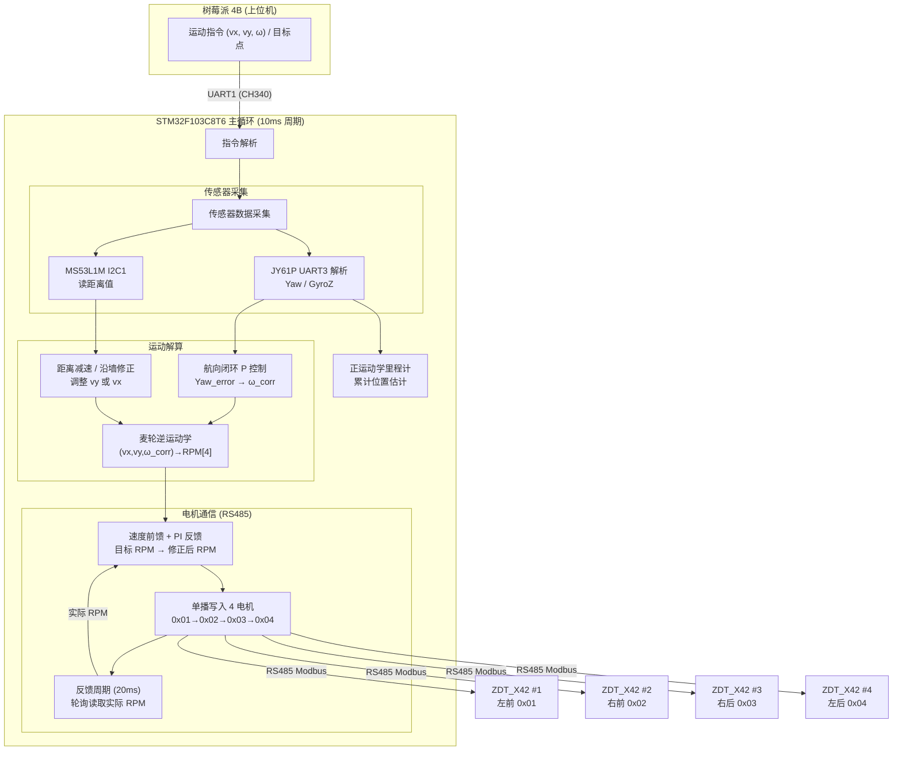

# 麦轮运动控制系统技术设计文档

> **项目**：智能物流搬运小车 — 底盘运动控制
> **MCU**：STM32F103C8T6 / STM32CubeIDE / HAL 库
> **版本**：V1.0
> **日期**：2026-05-12

---

## 目录

1. [系统概述与引脚分配](#1-系统概述与引脚分配)
2. [多电机 RS485 总线通信与寻址](#2-多电机-rs485-总线通信与寻址)
3. [电机实时转速反馈与闭环控制](#3-电机实时转速反馈与闭环控制)
4. [麦克纳姆轮运动学模型与速度分解](#4-麦克纳姆轮运动学模型与速度分解)
5. [传感器融合与航向稳定控制](#5-传感器融合与航向稳定控制)
6. [控制流程总图与 HAL 外设清单](#6-控制流程总图与-hal-外设清单)

---

## 1. 系统概述与引脚分配

### 1.1 系统架构

```
┌─────────────────────────────────────────────────────────┐
│                    树莓派 4B (上位机)                      │
│  视觉识别 · 路径规划 · 任务调度                             │
│  UART (经 CH340-1) ↔ STM32 UART1                        │
└──────────────────────┬──────────────────────────────────┘
                       │ 自定义二进制帧协议 (115200-8N1)
┌──────────────────────▼──────────────────────────────────┐
│              STM32F103C8T6 (运动控制核心)                  │
│                                                         │
│  ┌──────────┐  ┌──────────┐  ┌──────────────────────┐  │
│  │ UART3    │  │ I2C1     │  │ UART2 → RS485 总线    │  │
│  │ JY61P    │  │ MS53L1M  │  │ 4× ZDT_X42 步进电机   │  │
│  │ 姿态/航向 │  │ 距离感知  │  │ Modbus-RTU (半双工)   │  │
│  └──────────┘  └──────────┘  └──────────────────────┘  │
│                                                         │
│  核心任务：                                               │
│  · 麦轮逆运动学解算 (vx,vy,ω → RPM1~4)                    │
│  · 航向闭环纠偏 (JY61P Yaw → PI 修正角速度)               │
│  · Modbus 多机轮询与同步控制                               │
│  · 通讯超时安全停车                                       │
└─────────────────────────────────────────────────────────┘
```

### 1.2 完整引脚分配

| 外设 | STM32 引脚 | 功能 | 备注 |
|---|---|---|---|
| 树莓派通讯 | PA9 (TX), PA10 (RX) | USART1 | 经板载 CH340-1 |
| JY61P IMU | PB10 (TX), PB11 (RX) | USART3 | 115200-8N1, 3.3V TTL |
| MS53L1M 激光 | PB6 (SCL), PB7 (SDA) | I2C1 | 100kHz, 地址 0x52 |
| RS485 总线 | PA2 (TX), PA3 (RX) | USART2 | 经 SP3485 转 RS485 |
| RS485 方向控制 | **PA1** | GPIO 推挽输出 | DE/RE 联合控制（高=发送，低=接收） |
| 急停按钮 | PB12 | GPIO 外部中断 | 双沿触发 |
| 状态 LED | PC13 | GPIO 推挽输出 | 低电平点亮，板载 LED |

> **RS485 方向引脚说明**：SP3485 的 DE（发送使能）和 RE（接收使能）可并联由同一 GPIO 控制。PA1 输出高 → 发送模式，PA1 输出低 → 接收模式。SP3485 内部 RE 为低有效，DE 为高有效，并联后逻辑自洽。

### 1.3 现有代码资产

以下驱动文件已在 `D:\STM32CubeIDE\workspace_1.19.0\ATK-YJ` 中就绪：

| 文件 | 功能 | 注意事项 |
|---|---|---|
| `jy61p.c/h` | JY61P 驱动 | **当前为 I2C 实现**，本阶段需改为 UART 接收（JY61P 模块默认串口输出 0x55 帧头数据包） |
| `atk_ms53l1m.c/h` | VL53L1X I2C 驱动 | 已集成 ST 官方 API，距离读取 OK |
| `imu_app.c/h` | IMU 应用层 | 封装数据获取接口 |
| `laser_app.c/h` | 激光应用层 | 封装周期读取 |
| `board_app.c/h` | 板级应用入口 | 统一初始化 + 主循环调度 |

---

## 2. 多电机 RS485 总线通信与寻址

### 2.1 从机地址分配与修改

四台 ZDT_X42 驱动板出厂默认地址通常均为 `0x01`，必须逐一修改为不同地址才能在同一 RS485 总线上工作。

**修改方法**：

1. **逐台上电修改**：每次仅给一台驱动板供电，通过 Modbus 写寄存器命令修改其从机地址，保存后断电
2. **目标地址分配**：

| 物理位置 | 新 Modbus 地址 | 说明 |
|---|---|---|
| 左前轮 (FL) | 0x01 | Front-Left |
| 右前轮 (FR) | 0x02 | Front-Right |
| 左后轮 (RL) | 0x03 | Rear-Left |
| 右后轮 (RR) | 0x04 | Rear-Right |

3. **地址修改寄存器**（ZDT_X42 通用寄存器）：

| 操作 | 寄存器地址 | 写入值 | 说明 |
|---|---|---|---|
| 设置从机地址 | `0x0020` | `0x0001` ~ `0x0004` | 写新地址 |
| 保存参数到 EEPROM | `0x0007` | `0x0001` | 掉电保存，否则重新上电恢复默认 |

4. **操作流程**：

```
单台驱动板加电 → 等待自检完成 (OLED 正常显示)
  → Modbus 写 0x0020 = 目标地址
  → Modbus 写 0x0007 = 0x0001 (保存)
  → 断电
  → 换下一台，重复
```

> 修改后需用新地址重新建立通信，确认读取寄存器 `0x0010`（固件版本）返回值正确。

---

### 2.2 Modbus-RTU 帧结构

#### 2.2.1 标准帧格式（以写速度指令为例）

Modbus-RTU 通用帧结构：

| 字段 | 字节数 | 内容 |
|---|---|---|
| 从机地址 | 1 | `0x01` ~ `0x04` |
| 功能码 | 1 | `0x10`（写多个寄存器）或 `0x06`（写单个寄存器） |
| 寄存器起始地址 | 2 | 高字节在前 |
| 寄存器数量 | 2 | 高字节在前 |
| 数据字节数 | 1 | N（寄存器数 × 2） |
| 数据 | N | 高字节在前 |
| CRC16 | 2 | 低字节在前 |

#### 2.2.2 直通限速位置模式指令帧

设置电机以指定速度和方向连续运转（无限位），使用 ZDT 自定义功能码 `0xFB`：

| 字段 | 值 | 说明 |
|---|---|---|
| 从机地址 | `0x01` ~ `0x04` | 单播控制 |
| 功能码 | `0xFB` | ZDT 自定义：直通速度控制 |
| 寄存器地址 | `0x00F0` | 控制命令寄存器 |
| 方向 | 2 bytes | `0x0000` = 正向（CW），`0x0001` = 反向（CCW） |
| 速度 | 2 bytes | 目标转速 RPM，无符号整数 |
| 位置/角度 | 4 bytes | 直通模式填 `0x00000000` |
| CRC16 | 2 bytes | 标准 Modbus CRC（多项式 `0xA001`） |

**完整帧示例**——左前轮（0x01）正向 60 RPM：

```
01 FB 00F0 0000 003C 00000000 [CRC_LO] [CRC_HI]
```

> **注意**：`0xFB` 为 ZDT 自定义功能码，其帧结构与标准 Modbus 写操作类似但在数据段格式上有所差异。ZDT 官方例程代码中的帧封装函数应直接复用，避免自行拼接导致格式错误。

#### 2.2.3 读取实时转速帧

| 字段 | 值 | 说明 |
|---|---|---|
| 从机地址 | `0x01` ~ `0x04` | 单播 |
| 功能码 | `0x03` | 标准 Modbus 读保持寄存器 |
| 寄存器起始地址 | `0x0022` | 实时转速寄存器 |
| 寄存器数量 | `0x0001` | 读 1 个寄存器（2 字节） |
| CRC16 | 2 bytes | |

**响应帧**：

| 字段 | 说明 |
|---|---|
| 从机地址 | 原地址 |
| 功能码 | `0x03` |
| 数据字节数 | `0x02` |
| 转速值 | 2 bytes，有符号 16 位，单位 RPM |
| CRC16 | 2 bytes |

#### 2.2.4 读取实时位置（编码器累计角度）

| 寄存器地址 | 长度 | 数据类型 | 说明 |
|---|---|---|---|
| `0x0024` | 2 registers (4 bytes) | int32 | 当前编码器累计角度（需按细分数换算） |

#### 2.2.5 多机同步广播帧

使所有已接收运动指令的电机同时启动：

| 字段 | 值 | 说明 |
|---|---|---|
| 从机地址 | `0x00` | 广播地址 |
| 功能码 | `0xFF` | 自定义 |
| 子命令 | `0x66` | 触发多机同步运动 |
| CRC16 | 2 bytes | |

---

### 2.3 单播轮询 vs 广播控制策略

**速度指令下发采用「单播参数 + 广播同步」方案**：

```
┌──────────────────────────────────────────────────────┐
│ 控制周期 10ms (100Hz)                                 │
│                                                      │
│  1. 逆运动学解算 → 得到四轮目标 RPM (r1,r2,r3,r4)       │
│                                                      │
│  2. 单播写入四台电机 (顺序发送，利用 RS485 半双工):        │
│     for addr in [0x01, 0x02, 0x03, 0x04]:            │
│         RS485_TX_Enable()                            │
│         HAL_UART_Transmit(addr, 0xFB, rpm, ...)       │
│         RS485_Wait_TX_Complete()    ← 等待 UART TC     │
│         RS485_RX_Enable()                            │
│                                                      │
│  3. 广播同步触发 (可选，仅在需四轮严格同时启动时):         │
│     RS485_TX_Enable()                                │
│     HAL_UART_Transmit(0x00, 0xFF 0x66, ...)           │
│     RS485_RX_Enable()                                │
│                                                      │
│  ⚠ 广播同步会中断所有电机当前动作并执行新指令            │
│     对于连续速度控制场景，可省略同步帧，直接单播覆盖       │
└──────────────────────────────────────────────────────┘
```

**策略选择**：

| 场景 | 推荐方式 | 理由 |
|---|---|---|
| 连续速度更新（100Hz） | 单播轮询，不广播 | 逐次更新已在 10ms 内完成，无需额外的同步开销 |
| 启停 / 离散位置指令 | 单播参数 + 广播同步 | 确保四轮严格同时启动 / 停止 |
| 紧急停车 | 广播帧最高优先 | 地址 0x00 的停止指令所有电机同时响应 |

---

### 2.4 RS485 半双工收发切换时序

```
        发送阶段                           接收阶段
  ┌──────────────────┐              ┌──────────────────┐
  │ PA1 = HIGH (DE=1) │              │ PA1 = LOW (RE=0)  │
  │ 发送使能           │              │ 接收使能           │
  └──────────────────┘              └──────────────────┘
         ↑                                  ↑
         │                                  │
  ┌──────┴──────────────────────────────────┴──────┐
  │             RS485 收发控制软件流程               │
  │                                                │
  │  1. PA1 = HIGH          (DE/RE → 发送)          │
  │  2. Delay 50μs          (等待发送器稳定)          │
  │  3. HAL_UART_Transmit() (启动 DMA / IT 发送)     │
  │  4. 等待 UART_TC 标志   (发送完成，非 TXE)        │
  │  5. Delay 50μs          (等待最后一个停止位发出)    │
  │  6. PA1 = LOW           (DE/RE → 接收)           │
  └────────────────────────────────────────────────┘
```

**时序注意事项**：

| 要点 | 说明 |
|---|---|
| **发送完成判断** | 必须用 `UART_FLAG_TC`（发送完成标志），不能用 `UART_FLAG_TXE`（发送缓冲区空）。TXE 在最后一个字节移入移位寄存器时立即置位，此时数据还在总线上 |
| **TC 后延时** | SP3485 在 115200bps 下每 bit 约 8.68μs，一个停止位后需等待至少 8.68μs。50μs 延时含足量裕度 |
| **使能后延时** | SP3485 驱动器使能到输出稳定典型值 < 2μs，50μs 为保守值，确保总线电平建立 |
| **默认状态** | 系统初始化后 PA1 = 0（接收模式），总线处于监听状态 |
| **DMA 发送** | 若使用 DMA，在 `HAL_UART_TxCpltCallback` 中启动一个硬件定时器单次延时（约 100μs），超时后再切换为接收模式 |

**推荐实现**：使用定时器（TIM4）通道产生精确延时，硬件自动在延时结束后置 PA1 为低。避免在中断服务函数中用软件延时死等。

---

### 2.5 Modbus CRC16 校验

- 多项式：`0xA001`（Modbus 标准，初始值 `0xFFFF`）
- 算法：查表法或逐位计算，参考 ZDT 官方例程中的 `CRC16_Modbus()` 函数
- 校验范围：从地址字节到数据段最后一字节（不含 CRC 自身）

---

## 3. 电机实时转速反馈与闭环控制

### 3.1 转速反馈读取

#### 寄存器定义

| 参数 | 值 |
|---|---|
| 寄存器地址 | `0x0022` |
| 功能码 | `0x03`（读保持寄存器） |
| 数据长度 | 1 个寄存器（2 字节） |
| 数据类型 | `int16`，单位 RPM |
| 符号 | 正值 = CW（正向），负值 = CCW（反向） |

> **换算**：直接使用 int16 值即为 RPM，无需额外运算。若需转换为轮缘线速度（mm/s）：`v = RPM × π × 75 / 60`。

#### 四电机转速同时读取策略

由于 RS485 为半双工，无法并行读取，采用 **顺序轮询**：

```
每个速度反馈周期 (20ms, 50Hz):
  for addr in [0x01, 0x02, 0x03, 0x04]:
      RS485_TX_Enable()
      HAL_UART_Transmit(read_speed_frame[addr])
      等待接收响应 (UART RX 中断 / DMA 接收)
      RS485_RX_Enable()
      parsed_speed[addr] = response.rpm_value
```

**单帧读取耗时估算**（115200bps）：
- 请求帧 8 字节：~0.7ms
- 响应帧 7 字节：~0.6ms
- 收发切换 + 等待：~0.2ms
- **单电机合计**：~1.5ms
- **四电机轮询**：~6ms

**控制周期 = 10ms，反馈周期 = 20ms 的柱状调度**：

```
时间轴 (ms)：  0    2    4    6    8   10   12   14   16   18   20
              ├────┼────┼────┼────┼────┼────┼────┼────┼────┼────┤
控制帧 (10ms): [写4电机速度]       [写4电机速度]       [写4电机速度]
反馈帧 (20ms): [读M1][读M2][读M3][读M4]              [读M1]...
```

> 反馈周期慢于控制周期的设计是合理的——电机速度环的响应远大于机械时间常数，50Hz 反馈速率足够。

---

### 3.2 主控侧速度 PID 设计

#### 3.2.1 是否需要额外 PID？

ZDT_X42 驱动板内部已完成「电流-速度-位置」三环 FOC 闭环控制。但以下因素决定了 **主控侧仍需加一层速度 PID**：

| 因素 | 说明 |
|---|---|
| **打滑补偿** | 电机编码器测的是电机轴转速，不是车轮对地面的真实速度。地面打滑时编码器读数正常但实际位移为零。PID 积分项可补偿打滑引起的速度偏差 |
| **响应速度** | ZDT 内部速度环参数出厂默认，未针对负载惯量调优。主控侧 PID 可加快整体速度响应 |
| **多轮协调** | 四个电机独立运行内部闭环，无法感知整体运动状态（航向偏转、轨迹偏移）。主控 PID 可引入全局误差修正 |
| **抗扰动** | 地面不平、负载变化等外部扰动，主控侧可通过前馈 + 反馈改善抗扰性能 |

**结论**：主控侧增加一层「外环速度 PID」，架构为 **级联控制**：

```
                        外环 (STM32)                     内环 (ZDT_X42)
                     ┌─────────────────┐            ┌──────────────────┐
期望速度 (RPM) ──→[Σ]→ PID → 修正后 RPM ──→ Modbus ──→ ZDT 内部三环闭环
                   ↑                             │
                   │                    ┌────────┘
                   │                    │ Modbus 回读
                   └──── 实际 RPM ←────┘
```

#### 3.2.2 PID 控制框图（完整级联架构）

```
                            ┌── 航向修正 ω_corr ──┐
                            │   (来自 5.2 节)       │
                            │                       │
  (vx,vy,ω)_cmd ──→ 逆运动学 ──→ r1~r4_cmd ──→ [Σ] ──→ PID_i ──→ Modbus 写 RPM ──→ ZDT_X42 电机
                            │                   ↑                        │
                            │                   │                        │
                            │         ┌─ 实际 RPM 回读 ←── Modbus 读 ────┘
                            │         │
                            └─ 前馈 ──┘  (feedforward: r_cmd 直接写入)
```

**工作模式**：前馈 + 反馈 PID

- **前馈通道**：逆运动学解算后的目标 RPM 直接写入电机（快速响应）
- **反馈通道**：`误差 = 目标 RPM − 实际 RPM`，经 PI 控制器产生修正增量
- **前馈 + 反馈叠加**：`最终指令 = 前馈 RPM + PI 修正值`

#### 3.2.3 PID 参数与控制周期

| 参数 | 建议值 | 依据 |
|---|---|---|
| 控制周期 T | **10ms (100Hz)** | 电机机械时间常数 ~50-100ms；100Hz 控制频率高于机械带宽 10× 以上，满足采样定理 |
| Kp | 0.3 ~ 0.8 | 先调，使电机快速跟踪目标，不振荡 |
| Ki | 0.05 ~ 0.2 | 消除稳态误差（打滑、负载不均引起） |
| Kd | **0（不使用）** | 反馈信号经 Modbus 通信已有 10-20ms 延迟，微分项会放大噪声 |
| 积分分离阈值 | `abs(error) < 30 RPM` | 大误差时不积分，防积分饱和 |
| 输出限幅 | ± 额定转速的 30% | PID 输出叠加到前馈上，防止指令越界 |

**离散化公式（位置式 PI）**：

```
u(k) = Kp × e(k) + Ki × T × Σ e(i)
最终 RPM = 前馈_目标RPM + u(k)
限幅: 最终 RPM ∈ [−MaxRPM, +MaxRPM]
```

#### 3.2.4 回读速度滤波与异常值处理

| 策略 | 参数 | 说明 |
|---|---|---|
| **低通滤波** | α = 0.3（一阶 IIR） | `filtered_rpm = α × raw_rpm + (1−α) × prev_filtered_rpm` |
| **跳变检测** | Δ > 200 RPM / 20ms | 若相邻两次回读差值超过阈值，判定为通信干扰/误码，丢弃本次值，沿用上次值 |
| **超时保护** | 1s 无响应 | 单电机连续 1 秒无 Modbus 应答 → 触发告警，强制停车 |
| **CRC 校验失败** | 重试 1 次 | Modbus 响应 CRC 错误时，重发一次读取帧；两次均失败则标记为通信异常 |

---

### 3.3 电机初始化流程

```
上电 → 等待 2s (自检)
  → for each addr in [0x01, 0x02, 0x03, 0x04]:
       ├─ 读 0x3B (回零状态标志位)，确认编码器就绪
       ├─ 读 0x0010 (固件版本)，记录
       ├─ 写 0x000A = 0x0001 (位置清零)
       └─ 读当前状态，确认无故障码
  → 初始化完成标志位置 1
  → 等待上位机运动指令
```

**故障码检查**：驱动板出现异常时，特定寄存器会置位。建议在初始化阶段读取一次故障状态寄存器，确认四台电机均处于正常状态后再进入运动控制。

---

## 4. 麦克纳姆轮运动学模型与速度分解

### 4.1 坐标系与轮序定义

```
                  +Y (前方)
                    ↑
                    │
          ┌─────────┼─────────┐
          │         │         │
          │  轮1(FL)│  轮2(FR) │
          │  ／     │     ＼   │
          │ 辊方向  │  辊方向   │
          │         │         │
   ←──────┼─────────┼─────────┼──────→ +X (右方)
          │         │         │
          │  轮4(RL)│  轮3(RR) │
          │  ＼     │     ／   │
          │ 辊方向  │  辊方向   │
          │         │         │
          └─────────┴─────────┘
```

**X 形布局**：四轮辊子方向形成 "X" 图案（从上方俯视）。左前(1)和右后(4)辊子方向一致，右前(2)和左后(3)辊子方向一致。

| 轮序号 | 物理位置 | Modbus 地址 | 电机安装方向 |
|---|---|---|---|
| 1 | 左前 (Front-Left) | 0x01 | 正装，辊子 \ 方向 |
| 2 | 右前 (Front-Right) | 0x02 | 正装，辊子 / 方向 |
| 3 | 右后 (Rear-Right) | 0x03 | 正装，辊子 / 方向 |
| 4 | 左后 (Rear-Left) | 0x04 | 正装，辊子 \ 方向 |

### 4.2 机械参数

| 参数 | 符号 | 值 | 单位 |
|---|---|---|---|
| 麦轮直径 | D | 75 | mm |
| 轮半径 | R | 37.5 | mm |
| 轮距（左右中心距） | W | 320 | mm |
| 轴距（前后中心距） | L | 220 | mm |
| 半轮距 | W/2 = b | 160 | mm |
| 半轴距 | L/2 = a | 110 | mm |
| 旋转力臂 | a + b | 270 | mm |

### 4.3 逆运动学方程（全局速度 → 四轮转速）

已知小车的目标全局运动 `(v_x, v_y, ω)`：
- `v_x`：沿 X 轴（横向）的线速度，m/s
- `v_y`：沿 Y 轴（纵向）的线速度，m/s
- `ω`：绕 Z 轴（垂直轴）的旋转角速度，rad/s，逆时针为正

**X 形布局逆运动学矩阵**：

```
┌      ┐    1   ┌                          ┐ ┌     ┐
│ v_1  │   ───  │  1    −1    −(a + b)     │ │ v_x │
│ v_2  │ =  R  │  1    +1    +(a + b)     │ │ v_y │
│ v_3  │       │  1    +1    −(a + b)     │ │  ω  │
│ v_4  │       │  1    −1    +(a + b)     │ └     ┘
└      ┘       └                          ┘
```

展开为标量形式：

```
v_1 = v_x − v_y − (a+b) × ω      (左前轮)
v_2 = v_x + v_y + (a+b) × ω      (右前轮)
v_3 = v_x + v_y − (a+b) × ω      (右后轮)
v_4 = v_x − v_y + (a+b) × ω      (左后轮)
```

其中 `a+b = 0.110 + 0.160 = 0.270 m`。

**线速度 v_i 转 RPM**：

```
RPM_i = v_i × 60 / (π × D)
      = v_i × 60 / (π × 0.075)
      = v_i × 254.65
```

**完整逆运动学伪代码**：

```c
#define WHEEL_DIAMETER_m      0.075f    // 轮径 75mm
#define HALF_WHEELBASE_m      0.110f    // 半轴距 a = 220/2 mm
#define HALF_TRACK_m          0.160f    // 半轮距 b = 320/2 mm
#define ROTATION_ARM_m        (HALF_WHEELBASE_m + HALF_TRACK_m)  // 0.270m
#define RPM_PER_MPS           (60.0f / (PI * WHEEL_DIAMETER_m))  // 254.65

// 输入: vx, vy (m/s), omega (rad/s)
// 输出: rpm[4] (RPM, 正值=正转, 负值=反转)
void Mecanum_InverseKinematics(float vx, float vy, float omega,
                               float rpm[4])
{
    // 四轮线速度 (m/s)
    float v[4];
    v[0] = vx - vy - ROTATION_ARM_m * omega;   // FL
    v[1] = vx + vy + ROTATION_ARM_m * omega;   // FR
    v[2] = vx + vy - ROTATION_ARM_m * omega;   // RR
    v[3] = vx - vy + ROTATION_ARM_m * omega;   // RL

    // 线速度转 RPM
    for (int i = 0; i < 4; i++) {
        rpm[i] = v[i] * RPM_PER_MPS;
    }
}
```

### 4.4 超限等比缩放

当任一目标轮转速超过电机额定转速时，需等比缩小所有四轮转速以保持速度方向不变：

```c
float Mecanum_ScaleToLimit(float rpm[4], float max_rpm)
{
    float max_abs = 0.0f;
    for (int i = 0; i < 4; i++) {
        float abs_rpm = fabsf(rpm[i]);
        if (abs_rpm > max_abs) max_abs = abs_rpm;
    }

    if (max_abs > max_rpm) {
        float scale = max_rpm / max_abs;
        for (int i = 0; i < 4; i++) {
            rpm[i] *= scale;
        }
    }
    return max_abs;  // 返回缩放前的最大绝对值，供调用方判断是否触发了缩放
}
```

> **缩放的意义**：当用户指令 `(vx, vy, ω)` 导致某轮转速超限时，等比缩放保留速度方向（运动意图），只降低幅值。这在转向 + 平移叠加指令中尤为关键——如果直接硬限幅，轨迹方向会改变。

### 4.5 正运动学（里程计推算）

四轮实际 RPM 反推小车的全局速度，用于里程计积分：

```
v_x = (RPM_1 + RPM_2 + RPM_3 + RPM_4) × (πD / 4) / 60
v_y = (−RPM_1 + RPM_2 + RPM_3 − RPM_4) × (πD / 4) / 60
ω   = (−RPM_1 + RPM_2 − RPM_3 + RPM_4) × (πD / 4) / (60 × (a+b))
```

> 正运动学用于里程计推算位置，与激光/IMU 数据融合（见第 5 节）。

---

## 5. 传感器融合与航向稳定控制

### 5.1 JY61P 陀螺仪数据接口

#### 通信方式说明

当前 `jy61p.c` 为 I2C 实现，但根据硬件手册，JY61P 模块在 UART 模式下直接输出固定格式数据包（无需请求帧），本阶段需将驱动改造为 **USART3 中断接收 + DMA 环形缓冲**。

#### UART 数据包格式

- 角度包（核心使用）：帧头 `0x55 0x53`，8 字节角度数据（Roll/Pitch/Yaw 各 2 字节 int16，0.01°），1 字节校验和
- 角速度包（航向阻尼用）：帧头 `0x55 0x52`，含三轴角速度

**数据包解析状态机**：

```
IDLE → 收到 0x55 → WAIT_TYPE → 收到 0x53(角度)/0x52(角速度)/0x51(加速度)
      → WAIT_DATA → 累积 8 字节 → WAIT_CHECKSUM
      → 校验通过 → 解析并更新全局变量 → IDLE
      → 校验失败 → g_imu_checksum_error_count++ → IDLE
```

#### JY61P 初始化配置流程

1. 上电后等待 300ms，模块进入默认串口数据输出模式（默认 10Hz，按已保存配置输出）
2. 如需修改输出速率或内容：解锁（写 `0x69 = 0xB588`）→ 写 RSW（`0x02`）设置输出内容 → 写 RRATE（`0x03`）设置速率至 **100Hz** → 保存（写 `0x00 = 0x0000`）
3. 航向角置零（校准）：解锁 → 写 `0x01 = 0x0004` → 保存

> **建议**：首次使用时通过上位机软件配置好 100Hz 输出速率并保存，之后每次上电自动恢复配置。100Hz 输出速率匹配 10ms 控制周期的需求。

---

### 5.2 航向角闭环纠偏控制

#### 控制目标

直线行驶时（目标角速度 ω_target = 0），利用 JY61P 航向角反馈自动修正因地面不平、轮径差异等引起的航向漂移，保持小车沿直线运动。

#### 控制架构：级联修正

```
                           ┌─────────────┐
   目标航向 Yaw_target ──→ [Σ] → P 控制器 → ω_corr
                           ↑               (角速度修正量)
                           │                   │
                    实际 Yaw ←── JY61P         │
                                           ┌──▼──────────────┐
   原始运动指令 (vx, vy, ω_cmd) ──────────→ 逆运动学解算       │
                                           │ ω_actual =       │
                                           │ ω_cmd + ω_corr   │
                                           └──────────────────┘
```

**核心公式**：

```
Yaw_error = Yaw_target − Yaw_current      // 航向角误差, 需归一化到 [−180°, +180°]
ω_corr = Kp_yaw × Yaw_error               // P 控制器输出角速度修正量
ω_actual = ω_cmd + ω_corr                 // 修正后的角速度输入逆运动学
```

#### 参数说明

| 参数 | 建议值 | 说明 |
|---|---|---|
| Kp_yaw | 0.5 ~ 2.0 | 航向 P 增益。单位：rad/s / rad。Kp=1 表示 1rad 误差产生 1rad/s 修正角速度（约 57°/s 修正速率） |
| 角度归一化函数 | — | 将 Yaw_error 归一化到 [−180°, +180°]，避免跨 ±180° 跳变 |
| 死区 | ±1° | Yaw_error 在 ±1° 以内不触发修正，避免微幅振荡 |
| 输出限幅 | ω_corr ∈ [−ω_max, +ω_max] | 防止航向修正过度干扰正常转向指令 |

> **为何用 P 而非 PI？** 航向角系统本身含有积分特性（角速度积分 = 角度），P 控制已能消除稳态角误差。引入 I 项容易在小车机动时产生积分饱和，需要复杂的积分分离和抗饱和逻辑，得不偿失。

---

### 5.3 ATK-MS53L1M 激光测距辅助定位

#### 当前可用能力

- 测距范围：40mm ~ 4000mm（长距离模式）
- 当前驱动状态：已集成 ST 官方 VL53L1X API，通过 `ATK_MS53L1M_ReadDistance()` 获取距离值（`g_laser_distance_mm`）
- 测量周期：~150ms（`SetInterMeasurementPeriodMilliSeconds(150)` 设定）

#### 辅助功能

**A. 沿墙走（Wall Following）**

保持小车与墙面恒定距离，适用于走廊 / 货架间导航：

```
IF 侧面激光测距值 < 目标距离 − 阈值:
    vx_adjust = −K_wall × (目标距离 − 当前距离)  // 远离墙
ELIF 侧面激光测距值 > 目标距离 + 阈值:
    vx_adjust = +K_wall × (当前距离 − 目标距离)  // 靠近墙
```

**B. 点到点减速控制**

接近目标位置时，根据激光测距值自动减速，防止惯性过冲：

```
IF 前方距离 < 减速阈值 (如 500mm):
    vy_cmd = vy_cmd × (当前距离 / 减速阈值)  // 线性减速
    IF 前方距离 < 停止阈值 (如 100mm):
        vy_cmd = 0;  紧急停车
```

**C. 特征匹配与位置重置**

利用激光检测已知结构（墙壁转角、货架立柱等），将这些特征点作为里程计误差的消除机会：

```
IF 检测到特征点（距离突变 > 阈值）:
    推算当前位置 = 特征点已知坐标 + 当前测距偏移
    重置里程计累计位置
```

#### 里程计 + 激光融合策略

```
                里程计 (正运动学，高频 100Hz)
                ├── 短期精度高，长期有积分漂移
                │
位置估计 ────── 激光测距 (低频 ~7Hz)
                ├── 提供绝对距离参考
                ├── 沿墙方向：修正横向漂移
                └── 前进方向：修正纵向里程计漂移
```

> **具体融合算法**：在沿墙走场景，激光提供垂直于墙面的绝对距离，作为该方向的「地面真相」。每次激光数据更新时，以 α=0.1 的指数平滑修正里程计在该方向上的累计位移。前进方向由于激光只能探测前方障碍物（无法感知已走过的路径），仅依赖里程计。

---

### 5.4 综合运动状态机

```
┌─────────┐
│   INIT  │ 上电，JY61P 航向置零，读取初始航向角
└────┬────┘
     │ 初始化完成
     ▼
┌─────────┐
│ STANDBY │ 等待上位机运动指令
└────┬────┘
     │ 收到目标速度向量 (vx, vy, ω) 或 目标点坐标
     ▼
┌──────────────┐
│ TARGET_ALIGN │ 计算目标航向角 Yaw_target = atan2(dy, dx)
└──────┬───────┘
     │
     ▼
┌──────────┐
│ MOVING   │ 循环执行 (100Hz):
│          │   1. 读取 JY61P Yaw
│          │   2. 计算 Yaw_error, 得出 ω_corr
│          │   3. 读取 MS53L1M 距离 → 减速判断 / 沿墙修正
│          │   4. 更新目标速度 (vy 根据距离衰减)
│          │   5. 逆运动学解算 (vx, vy, ω_corr) → RPM[4]
│          │   6. 速度 PI + 前馈 → Modbus 写入四个电机
│          │   7. (每 2 周期) 读取四电机实际转速反馈
│          │   8. 正运动学累积里程计
└────┬─────┘
     │
     ├── 激光距离 < 停止阈值? ──→ STOPPED (到达)
     ├── 急停信号? ──→ EMERGENCY_STOP
     └── 上位机停止指令? ──→ STOPPED
          │
          ▼
     ┌──────────┐
     │ ARRIVED  │ → 上报到达事件 → STANDBY
     └──────────┘

┌───────────────┐
│ EMERGENCY_STOP│ 立即发送广播停止帧 (addr=0x00, 功能码 停止)
└───────────────┘
   急停解除 + 上位机复位指令 → STANDBY
```

---

## 6. 控制流程总图与 HAL 外设清单

### 6.1 控制流程总图（Mermaid）



### 6.2 数据流汇总表

| 数据 | 方向 | 频率 | 途径 |
|---|---|---|---|
| 运动指令 (vx, vy, ω) | 树莓派 → STM32 | 50-100Hz | UART1 (CH340) |
| 底盘状态回传 | STM32 → 树莓派 | 10-20Hz | UART1 (CH340) |
| JY61P 角度/角速度 | JY61P → STM32 | 100Hz (自动输出) | USART3 |
| MS53L1M 距离 | MS53L1M → STM32 | ~7Hz | I2C1 |
| 速度 RPM 指令 | STM32 → ZDT_X42 ×4 | 100Hz | RS485 (USART2) |
| 速度 RPM 回读 | ZDT_X42 ×4 → STM32 | 50Hz | RS485 (USART2) |
| 紧急停止 | STM32 → ZDT_X42 ×4 | 事件触发 | RS485 (广播) |

### 6.3 HAL 外设清单与配置

| 外设 | 实例 | 引脚 | 配置 | 用途 |
|---|---|---|---|---|
| USART1 | huart1 | PA9 TX, PA10 RX | 115200-8N1, RX IT/DMA | 上位机通信 |
| USART2 | huart2 | PA2 TX, PA3 RX | 115200-8N1, RX IT + TX DMA | RS485 Modbus |
| USART3 | huart3 | PB10 TX, PB11 RX | 115200-8N1, RX DMA 环形缓冲 | JY61P IMU 数据接收 |
| I2C1 | hi2c1 | PB6 SCL, PB7 SDA | 100kHz, 7-bit | VL53L1X 激光测距 |
| TIM2 | htim2 | — | 72MHz, PSC=71, ARR=9999 → 100Hz | 主控制周期定时器 |
| TIM4 | htim4 | — | 72MHz, 单脉冲模式 | RS485 方向切换精确延时 |
| GPIO | PA1 | 推挽输出 | 默认 LOW | RS485 DE/RE 方向控制 |
| GPIO | PB12 | 外部中断 | 双沿触发 | 急停按钮 |
| GPIO | PC13 | 推挽输出 | 默认 HIGH (LED 灭) | 状态指示 |

#### 定时器详细配置

**TIM2 — 主控制周期 (100Hz)**：

| 参数 | 值 |
|---|---|
| 时钟源 | APB1 Timer Clock = 72MHz |
| 预分频器 (PSC) | 71（计数频率 1MHz） |
| 自动重装载 (ARR) | 9999（周期 = 10000 × 1μs = 10ms） |
| 中断 | TIM2 更新中断，在 ISR 中设置控制循环标志位 |
| 优先级 | 抢占优先级 2，子优先级 0 |

**TIM4 — RS485 方向切换延时**：

| 参数 | 值 |
|---|---|
| 模式 | 单脉冲模式 (One Pulse Mode) |
| 预分频器 | 71（计数频率 1MHz） |
| ARR | 99（100μs 延时） |
| 输出 | 可选：TIM4_CH1 输出比较，硬件控制 PA1；或 ISR 中软件翻转 |

> 若 PA1 未被 TIM4 通道复用，则在 TIM4 更新中断 ISR 中软件清除 PA1（切换为接收模式）。

### 6.4 中断优先级划分

STM32F103 使用 4 位抢占优先级（0-15），数字越小优先级越高。

| 中断源 | 抢占优先级 | 子优先级 | 说明 |
|---|---|---|---|
| 急停按钮 (EXTI) | 0 | 0 | **最高优先级**，立即安全停车 |
| TIM2 (控制周期) | 1 | 0 | 确保控制周期稳定，抖动 < 50μs |
| TIM4 (RS485 延时) | 2 | 0 | 精确控制收发切换 |
| USART2 RX (Modbus 响应) | 3 | 0 | 电机反馈数据及时接收 |
| USART3 DMA (JY61P 数据) | 3 | 1 | IMU 数据 DMA 完成 |
| USART1 RX (上位机) | 4 | 0 | 上位机指令接收 |
| I2C1 (激光) | 5 | 0 | 激光数据读取完成 |
| Systick (HAL 时钟) | 15 | 0 | 系统时基，最低优先 |

**优先级划分原则**：
- **安全优先**：急停信号最高优先，在任何情况下都能在 1 个指令周期内触发
- **实时性**：控制周期是运动系统的心脏，TIM2 优先级高于所有通信中断，保证 100Hz 稳定运行
- **通信不丢数**：Modbus 响应帧和 JY61P 数据帧在 115200bps 下字节间隔仅 87μs，USART2/3 中断优先于非实时通信
- **非抢占控制周期**：所有通信中断优先级低于 TIM2，避免通信处理打断控制计算

### 6.5 多电机同步启停机制

**启动流程**：

```
1. 向四台电机逐一发送速度指令 (0xFB)，各电机预存指令但不执行
2. 发送广播同步帧 (0x00 0xFF 0x66)
3. 四台电机严格同时开始运动
```

**停止流程**：

```
普通停止：
  广播同步帧带零速指令 = 四轮同时停止

紧急停止：
  GPIO PB12 外部中断 → ISR 中:
    1. PA1 = HIGH (RS485 发送模式)
    2. HAL_UART_Transmit(紧急停止广播帧)  // 死等发送完成
    3. PA1 = LOW
    4. g_emergency_stop_flag = 1
  → 主循环检测标志位 → 告知上位机 → 等待复位指令
```

> 急停 ISR 中使用 HAL_UART_Transmit 阻塞发送，因为急停场景下控制周期的正常执行已无意义（所有电机已刹车），不会影响系统安全。阻塞发送确保急停帧在所有情况下都能发出。

### 6.6 通讯超时安全停车

```c
// 在主控制循环中检查
if (HAL_GetTick() - last_cmd_tick > CMD_TIMEOUT_MS) {
    // 上位机通讯超时（如树莓派死机、串口线松脱）
    // 执行安全停车
    g_cmd_timeout_flag = 1;
    Emergency_Stop();  // 广播停止 → 所有电机刹车
}
```

建议超时阈值 `CMD_TIMEOUT_MS = 500ms`。

---

## 附录 A：关键寄存器速查

### ZDT_X42 Modbus 寄存器

| 寄存器地址 | 功能码(R/W) | 数据长度 | 说明 |
|---|---|---|---|
| `0x0007` | 0x06 (W) | 1 reg | 写 0x0001 保存参数到 EEPROM |
| `0x000A` | 0x06 (W) | 1 reg | 写 0x0001 位置清零 |
| `0x0010` | 0x03 (R) | 1 reg | 固件版本号 |
| `0x0020` | 0x06 (W) | 1 reg | 从机地址设置 (1-247) |
| `0x0022` | 0x03 (R) | 1 reg | 实时转速 (int16, RPM) |
| `0x0024` | 0x03 (R) | 2 regs | 当前位置 (int32, 需按细分换算) |
| `0x003B` | 0x03 (R) | 1 reg | 回零/编码器状态标志位 |
| `0x00F0` | 0xFB (W) | — | 直通限速位置控制命令 |

### JY61P 关键配置

| 寄存器 | 地址 | 说明 |
|---|---|---|
| KEY (解锁) | 0x69 | 写 0xB588 解锁 |
| CALSW | 0x01 | 写 0x0004 航向角置零 |
| SAVE | 0x00 | 写 0x0000 保存配置 |
| RSW (输出内容) | 0x02 | 设置输出数据内容 |
| RRATE (输出速率) | 0x03 | 设置数据输出速率 |

### JY61P 数据包帧头

| 数据包类型 | 帧头 | 数据长度 |
|---|---|---|
| 加速度 | 0x55 0x51 | 8 bytes |
| 角速度 | 0x55 0x52 | 8 bytes |
| 角度 | 0x55 0x53 | 8 bytes |

---

## 附录 B：电机额定参数假设

> **以下为设计假设值**，需根据 ZDT_X42 实际参数手册修正。

| 参数 | 假设值 | 说明 |
|---|---|---|
| 额定转速 | 300 RPM | 在负载下稳定运行的最高转速 |
| 空载最大转速 | 500 RPM | 空载 / 轻载可达转速 |
| 控制死区 | ±5 RPM | 低于此值电机可能不响应，速度指令需做死区处理 |

**速度指令死区处理**：

```c
if (fabsf(rpm_cmd) < RPM_DEADZONE) {
    rpm_cmd = 0.0f;  // 低于死区直接输出零速
}
```

---

## 附录 C：项目文件结构建议

```
ATK-YJ/
├── Core/
│   ├── Inc/
│   │   ├── main.h
│   │   ├── board_app.h          (已有)
│   │   ├── jy61p.h              (已有，需改为 UART 模式)
│   │   ├── imu_app.h            (已有)
│   │   ├── atk_ms53l1m.h        (已有)
│   │   ├── laser_app.h          (已有)
│   │   ├── modbus.h             (新增：Modbus CRC/帧封装)
│   │   ├── zdt_motor.h          (新增：ZDT_X42 电机驱动)
│   │   ├── mecanum.h            (新增：麦轮运动学)
│   │   ├── motion_control.h     (新增：运动控制融合)
│   │   └── pid.h                (新增：PID 控制器)
│   └── Src/
│       ├── main.c               (已有，需增加控制循环)
│       ├── board_app.c          (已有)
│       ├── jy61p.c              (已有，需改为 UART 模式)
│       ├── imu_app.c            (已有)
│       ├── atk_ms53l1m.c        (已有)
│       ├── laser_app.c          (已有)
│       ├── modbus.c             (新增)
│       ├── zdt_motor.c          (新增)
│       ├── mecanum.c            (新增)
│       ├── motion_control.c     (新增)
│       └── pid.c                (新增)
```
